# Benchmarking Semantic Segmentation for Liver & Tumor CT (LiTS)

**Course:** CSE 348 — Digital Image Processing · Assignment Part 1
**Department of Computer Science and Engineering, East West University**

**Group members**
| # | Name | Student ID |
|---|------|-----------|
| 1 | Md. Asif Hossain | 2022-3-60-007 |
| 2 | Nabil Subhan | 2022-3-60-063 |
| 3 | Nudar | 2022-3-60-234 |

> A leakage-safe benchmark of **three architecturally distinct** semantic segmentation models —
> **DeepLabV3-ResNet50** (CNN + ASPP), **SegFormer-B0** (hierarchical transformer), and
> **YOLOv26-sem** (real-time detector adapted to per-pixel) — on the **LiTS 256×256** liver+tumor CT
> dataset, under one identical training recipe.
>
> 📓 Notebooks: [`eda-and-data-prep`](eda-and-data-prep.ipynb) · [`seg-deeplabv3`](seg-deeplabv3.ipynb) ·
> [`seg-segformer-b0`](seg-segformer-b0.ipynb) · [`seg-yolov26-semantic`](seg-yolov26-semantic.ipynb)
> 🎓 Viva prep: **[CODING_QUESTIONS.md](CODING_QUESTIONS.md)** (every Expected Coding Question answered against our code).

---

## TL;DR — final result

| Model | mIoU | mean Dice | liver IoU | **tumor IoU** | tumor Dice | **tumor sensitivity** | params | train |
|---|---|---|---|---|---|---|---|---|
| **DeepLabV3-R50** | **0.768** | **0.842** | 0.903 | **0.407** | **0.578** | **0.451** | 42 M | 256 min |
| SegFormer-B0 | 0.753 | 0.829 | 0.885 | 0.381 | 0.551 | 0.406 | **3.7 M** | **105 min** |
| YOLOv26-sem | 0.749 | 0.819 | **0.914** | 0.338 | 0.505 | 0.347 | 6.5 M | 356 min |

**DeepLabV3 wins** on mIoU and every tumor metric; **SegFormer-B0 is the efficiency champion** (11× smaller,
2.4× faster, ~1.5 mIoU points behind); **YOLO** leads on liver but is weakest on tumor. Liver is essentially
solved (~0.90 IoU); **tumor is the hard, extremely-imbalanced class** and the true differentiator.

---

## 1. Dataset & Exploratory Data Analysis (Task A)

**LiTS 256×256** — 131 patient CT volumes, 58,638 axial slices. Each slice ships as an image plus **two
separate binary (0/255) masks** (`Liver_mask/`, `Tumor_mask/`), which we **fuse** into a single class-index
label: `bg = 0`, `liver = 1`, `tumor = 2` (tumor written last → **precedence**).

The pixel-level class distribution is extremely imbalanced — tumor is only **0.13%** of pixels:

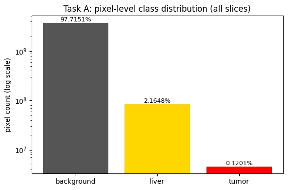

*Pixel-level class distribution (log scale). Background 97.7% / liver 2.2% / tumor 0.13% — a ~760:1
background-to-tumor ratio that dictates our loss, sampling, and checkpoint-selection choices.*

**Why we split by patient, not by slice** — adjacent slices of the same volume are near-identical
(perceptual-hash Hamming ≈ 1.9, i.e. 95% near-duplicate), whereas cross-volume slices are not (Hamming ≈
14.2). A per-slice split would leak the same patient into train and test:

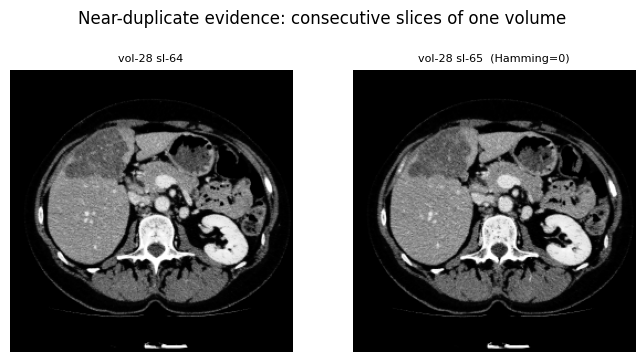

*Two consecutive slices of volume 28 are visually identical (Hamming = 0) — the empirical basis for
volume-grouped splitting.*

Representative image–mask pairs for each class (background-only, liver, tumor) confirm the fusion and
alignment are correct:

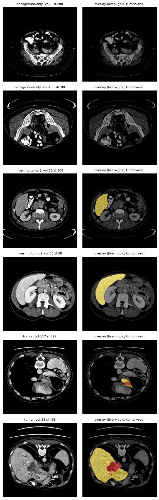

---

## 2. Method

**Shared, leakage-safe pipeline (defined in NB0, reused identically by all three models):**

- **Split (Task B):** grouped **by volume** → 92 / 20 / 19 volumes = 13,447 / 2,553 / 3,158 slices,
  `seed = 42`, hard-asserted zero overlap (`LEAKAGE CHECK PASSED`), saved once to `split.json`.
- **Filtering:** keep the **19,158 liver/tumor-containing slices** (drop 67% background-only slices).
- **2.5D input:** 3 channels = adjacent slices `[i−1, i, i+1]` — real volumetric context (leakage-safe:
  neighbours are same-volume = same split).
- **Augmentation (train only, Task C):** flips + affine + elastic/grid distortion + brightness/contrast +
  Gaussian noise, applied to image **and** mask synchronously via a single `Albumentations` call.
- **Tumor-slice oversampling:** `WeightedRandomSampler` (tumor slices 4×) → per-batch tumor prevalence
  ~12% → ~45%.
- **Loss:** `Dice + light class-weighted CrossEntropy [0.3, 1, 6]` (DeepLabV3 adds 0.4× auxiliary-head loss).
- **Optimisation:** AdamW, warmup(3) → cosine, weight-decay 1e-2, AMP, ≥ 50 epochs.
- **Model selection:** best checkpoint by **validation tumor-F2** (recall-weighted), not mIoU.
- **Inference:** horizontal-flip **test-time augmentation**.

| Model | Family | Params | Pretraining |
|---|---|---|---|
| DeepLabV3-ResNet50 | CNN encoder + **ASPP** head | 42 M | COCO |
| SegFormer-B0 | Hierarchical transformer (MiT-B0) + All-MLP head | 3.7 M | ADE20K |
| YOLOv26-sem | Real-time detector → per-pixel head | 6.5 M | Cityscapes |

---

## 3. Sanity check before training (Task D)

A required quality gate: post-augmentation training samples with mask overlays confirm image↔mask stay
aligned after flips/affine/elastic, and that labels remain `{0,1,2}`:

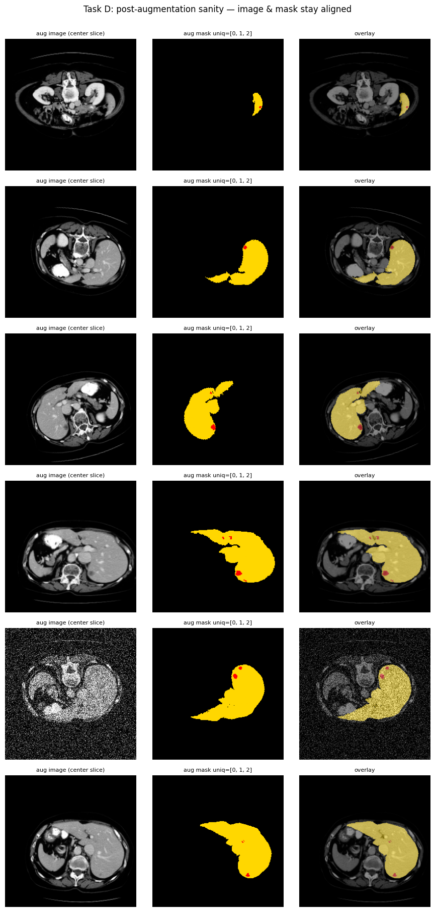

*Left→right: augmented image · fused mask · overlay (liver = gold, tumor = red). Tumor consistently sits
inside the liver and tracks the anatomy after augmentation — the pipeline is correct.*

---

## 4. Training (Task E)

All three models train ≥ 50 epochs. The DeepLabV3 curves are representative — the validation loss stays
**flat** (no overfitting divergence) and validation mIoU / tumor-F2 plateau; we checkpoint on the best
tumor-F2:

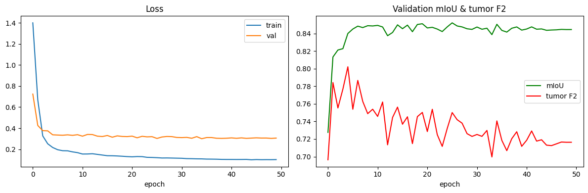

*Left: train vs. val loss (small, stable gap). Right: validation mIoU (green) and tumor-F2 (red). We select
the epoch with the best tumor-F2 — a recall-weighted, clinically-aligned criterion.*

---

## 5. Quantitative results (Task F)

Per-class IoU makes the story obvious — the models are near-identical on background and liver, and separate
**only on tumor**:

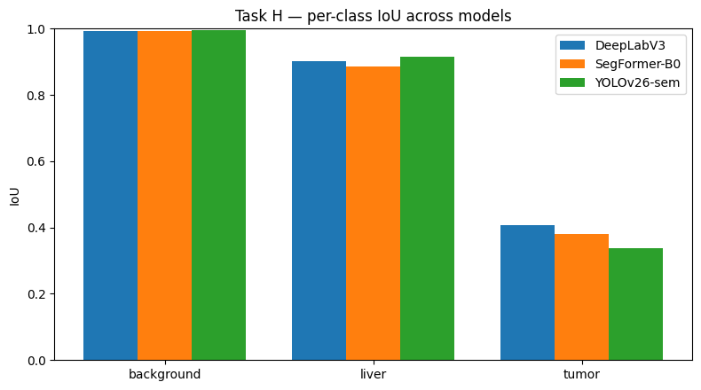

A multi-metric radar view and the overall + clinical bar chart:

<p>
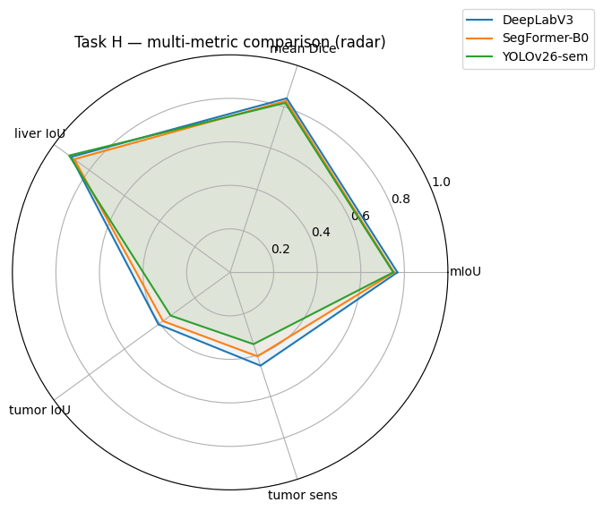
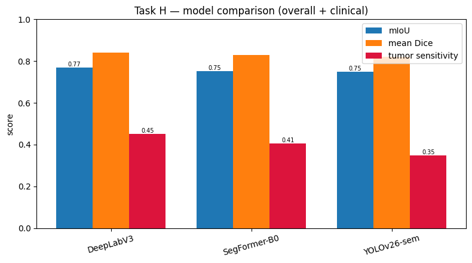
</p>

*The three models overlap almost perfectly on the easy axes and diverge on the two tumor axes, with
DeepLabV3 furthest out. Bars show mIoU, mean Dice, and tumor sensitivity.*

**Confusion matrices side-by-side** — every model leaks tumor → liver, but by different amounts (DeepLabV3
0.48, SegFormer 0.50, YOLO 0.60):

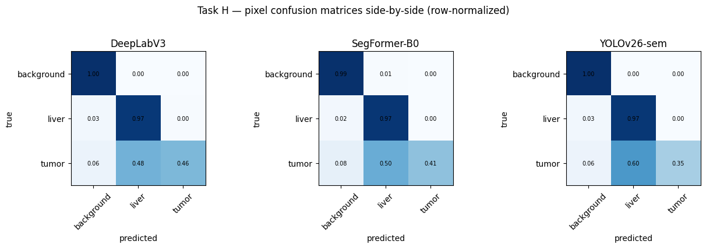

---

## 6. Qualitative comparison (Task H)

Same held-out test slices, all three models vs. ground truth:

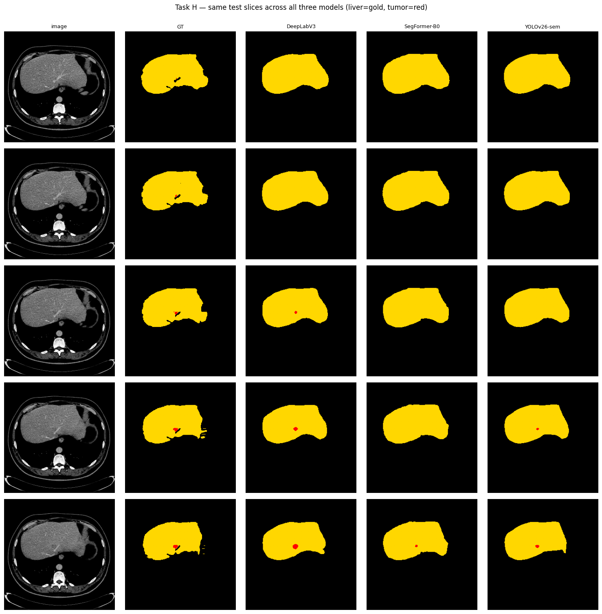

*Liver (gold) is near-perfect for all three; on the small-tumor rows, **DeepLabV3 recovers the red lesion**
while SegFormer/YOLO miss or under-segment it — the visual counterpart of the metric ranking.*

---

## 7. Error & failure analysis (Task G / H)

**Do the models fail on the same images?** Per-image IoU correlates at **r ≈ 0.91–0.93** across every pair —
the models agree on which slices are hard (difficulty is **data-driven**). Yet only **5 of each model's
worst-30 slices are shared by all three** (Jaccard 0.18–0.28) — the extreme tail is partly
**architecture-specific**.

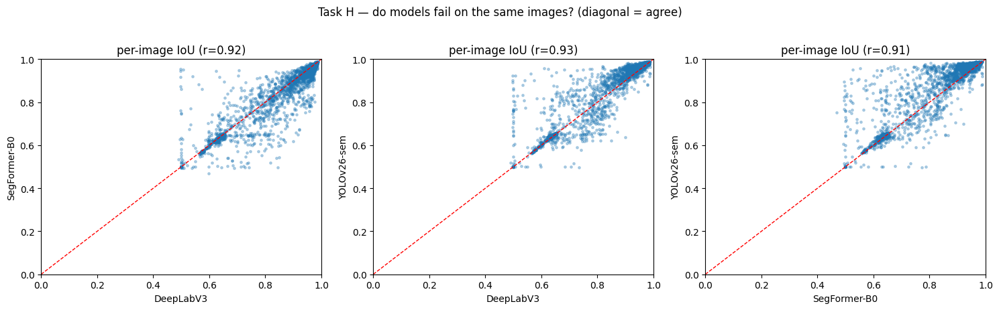

**Per-patient variance** — the clinically important spread that pooled metrics hide. Per-patient tumor Dice
ranges from ~0 to ~0.85: some patients' lesions are segmented well, others are essentially missed.

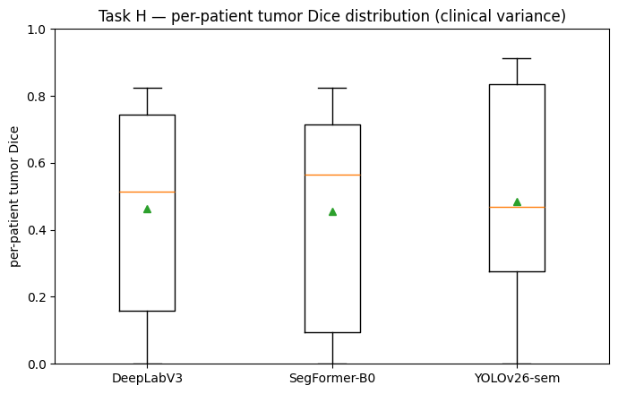

**Worst-case examples (DeepLabV3):** the hardest slices are liver-edge / tiny-tumor cases:

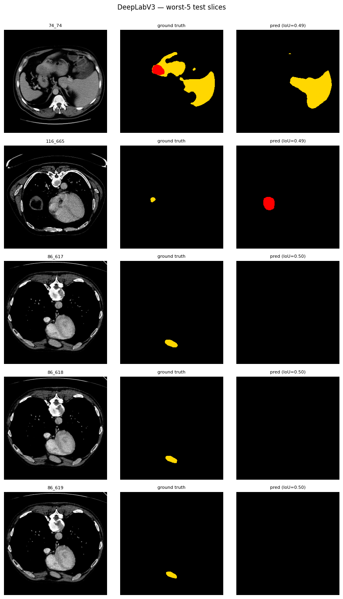

---

## 8. Ablation study

A controlled experiment (same split, models, epochs; one recipe change at a time) — this is the project's
core research contribution:

| Model | recipe | mIoU | tumor Dice | tumor sensitivity |
|---|---|---|---|---|
| DeepLabV3 | v1 baseline (flips, Dice+CE, mIoU-checkpoint) | 0.751 | 0.546 | — |
| DeepLabV3 | v2 (no-flip, Focal-Tversky) | 0.732 | 0.489 | 0.34 |
| DeepLabV3 | **v3 Run-A (2.5D + oversample + F2 + flips)** | **0.768** | **0.578** | **0.451** |

**Finding:** v2 *regressed* — removing flips gutted regularisation (train loss 0.16 → 0.07, val loss
diverged) and the Focal-Tversky was mis-parameterised. **v3** fixes the regularisation, adds 2.5D context
and recall-aligned selection, and beats the baseline. The correction was driven by a structured
multi-agent code review.

---

## 9. Verdict & deployment

- **Best accuracy / tumor sensitivity → DeepLabV3** — deploy where missing a lesion is the critical error.
- **Best efficiency → SegFormer-B0** — 11× smaller and 2.4× faster at ~equal accuracy; ideal for edge / limited compute.
- **YOLOv26-sem** — strongest liver, weakest tumor, slowest; its detector lineage down-samples away the tiny lesions.

## 10. Limitations & future work (Part 2)

- **2D only** on **pre-windowed 8-bit PNGs** — the clinical gold standard (3D nnU-Net on Hounsfield-Unit
  volumes) is out of scope by assignment rule, and this is the main tumor-accuracy ceiling.
- **Val→test tumor-recall gap** (~0.70 → ~0.45) reflects inter-patient heterogeneity on a 19-volume test set.
- **Next:** liver→tumor cascade, higher-resolution / true 3D input, uncertainty estimation, precision–recall
  operating-point analysis.

## 11. Reproducibility

`SEED = 42` (python/numpy/torch) · split saved once and reused · version-pinned imports · Kaggle T4×2 GPU ·
torch 2.10, transformers 5.0, albumentations 2.0.8, ultralytics 8.4.87. Each run saves its best checkpoint,
`results.json`, curves, confusion matrix and error grids.

## 12. Repository contents

```
eda-and-data-prep.ipynb        # NB0 — EDA, leakage-safe split, augmentation, sanity viz (Tasks A–D)
seg-deeplabv3.ipynb            # NB1 — DeepLabV3-R50 (Tasks E–G)
seg-segformer-b0.ipynb         # NB2 — SegFormer-B0 (Tasks E–G)
seg-yolov26-semantic.ipynb     # NB3 — YOLOv26-sem + Task H final comparison
CODING_QUESTIONS.md            # Expected Coding Questions, answered against our code (viva prep)
figures/                       # all graphs used in this README
README.md                      # this document
```

*References: DeepLabV3 (Chen et al., arXiv:1706.05587) · SegFormer (Xie et al., NeurIPS 2021) ·
Ultralytics YOLO semantic docs · nnU-Net (Isensee et al.) · LiTS Challenge (Bilic et al.).*
